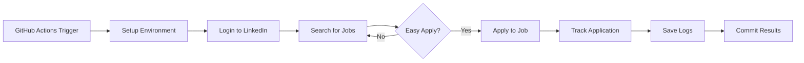

# LinkedIn Job Automation Bot

[](https://github.com/RidwanSassman0070786/linkedin-job-automation/actions)
[](LICENSE)

🤖 Automated GitHub Action to search and apply for remote global jobs on LinkedIn daily - targeting Solution Architect, AI Architect, and Cloud Architect positions.

## 🎯 Features

- **Automated Job Search**: Runs daily via GitHub Actions to search for relevant positions
- **Easy Apply Focus**: Only applies to jobs with LinkedIn's "Easy Apply" feature
- **Smart Tracking**: Maintains a record of applied jobs to avoid duplicates
- **Remote-First**: Searches for remote positions globally
- **Headless Automation**: Runs in the background without manual intervention
- **Comprehensive Logging**: Tracks all applications with detailed logs

## 🔍 Target Roles

The bot automatically searches for these positions:
- Solution Architect
- AI Architect  
- Cloud Architect
- Machine Learning Architect
- Enterprise Architect (AI/Cloud focus)

## 🚀 Quick Start

### Prerequisites

- GitHub account
- LinkedIn account with "Easy Apply" enabled
- Python 3.11+ (for local testing)

### Setup Instructions

#### 1. Fork/Clone this Repository

```bash
git clone https://github.com/RidwanSassman0070786/linkedin-job-automation.git
cd linkedin-job-automation
```

#### 2. Configure GitHub Secrets

Go to your repository's **Settings** → **Secrets and variables** → **Actions** and add:

| Secret Name | Description | Required |
|------------|-------------|----------|
| `LINKEDIN_EMAIL` | Your LinkedIn login email | ✅ Yes |
| `LINKEDIN_PASSWORD` | Your LinkedIn password | ✅ Yes |

**⚠️ Security Note**: Never commit credentials to your repository. Always use GitHub Secrets.

#### 3. Enable GitHub Actions

1. Go to the **Actions** tab in your repository
2. Click "I understand my workflows, go ahead and enable them"
3. The workflow will run automatically daily at 8:00 AM UTC

#### 4. Manual Trigger (Optional)

You can manually trigger the workflow:
1. Go to **Actions** → **Daily LinkedIn Job Search**
2. Click "Run workflow" → "Run workflow"

## 📋 How It Works



### Workflow Steps

1. **Schedule**: Runs daily at 8:00 AM UTC (customizable in `.github/workflows/daily_job_search.yml`)
2. **Login**: Authenticates with LinkedIn using encrypted credentials
3. **Search**: Queries LinkedIn for remote architecture positions
4. **Filter**: Identifies jobs with "Easy Apply" option
5. **Apply**: Submits applications automatically
6. **Track**: Records applied job IDs in `applied_jobs.json`
7. **Log**: Saves detailed execution logs as artifacts

## 📁 Repository Structure

```
linkedin-job-automation/
├── .github/
│   └── workflows/
│       └── daily_job_search.yml    # GitHub Actions workflow
├── linkedin_job_bot.py              # Main automation script
├── applied_jobs.json                # Track applied jobs (auto-generated)
├── linkedin_bot.log                 # Execution logs (auto-generated)
├── requirements.txt                 # Python dependencies
├── .gitignore                       # Git ignore rules
├── LICENSE                          # MIT License
└── README.md                        # This file
```

## 🛠️ Local Development

### Install Dependencies

```bash
pip install -r requirements.txt
```

### Set Environment Variables

```bash
export LINKEDIN_EMAIL="your-email@example.com"
export LINKEDIN_PASSWORD="your-password"
```

### Run Locally

```bash
python linkedin_job_bot.py
```

## ⚙️ Configuration

### Customize Search Criteria

Edit `linkedin_job_bot.py` to modify:

```python
# Line ~200: Modify job search queries
job_searches = [
    'Solution Architect',
    'AI Architect',
    'Cloud Architect',
    'Your Custom Role'
]
```

### Change Schedule

Edit `.github/workflows/daily_job_search.yml`:

```yaml
schedule:
  # Run every day at 8:00 AM UTC
  - cron: '0 8 * * *'
```

**Cron Examples:**
- `0 8 * * *` - Daily at 8:00 AM UTC
- `0 */6 * * *` - Every 6 hours
- `0 9 * * 1-5` - Weekdays at 9:00 AM UTC

### Adjust Application Limits

Modify the bot behavior in `linkedin_job_bot.py`:

```python
# Line ~100: Limit jobs per search
job_cards[:20]  # Change 20 to your desired limit
```

## 📊 Monitoring

### View Logs

1. Go to **Actions** tab
2. Click on a workflow run
3. Download "bot-logs" artifact
4. Open `linkedin_bot.log`

### Track Applications

The `applied_jobs.json` file is automatically updated and committed after each run:

```json
[
  "job_id_1",
  "job_id_2", 
  "job_id_3"
]
```

## 🔒 Security Best Practices

- ✅ **Use GitHub Secrets**: Never hardcode credentials
- ✅ **Enable 2FA**: Use LinkedIn 2FA with app passwords if possible
- ✅ **Regular Updates**: Keep dependencies updated
- ✅ **Monitor Activity**: Check LinkedIn for unusual activity
- ✅ **Rate Limiting**: Built-in delays prevent account flagging

## ⚠️ Important Disclaimers

1. **LinkedIn Terms of Service**: Automated tools may violate LinkedIn's ToS. Use at your own risk.
2. **Account Security**: Monitor your account for any unusual activity
3. **Application Quality**: Review auto-applied jobs regularly
4. **CAPTCHA**: The bot cannot handle CAPTCHA challenges automatically
5. **Multi-Factor Authentication**: May require manual intervention

## 🐛 Troubleshooting

### Common Issues

**Problem**: Workflow fails with "Login failed"
- **Solution**: Verify `LINKEDIN_EMAIL` and `LINKEDIN_PASSWORD` secrets are correct
- **Solution**: Check if LinkedIn requires additional verification

**Problem**: No jobs being applied to
- **Solution**: Modify search criteria to broader terms
- **Solution**: Check if "Easy Apply" filter is too restrictive

**Problem**: Bot is detected as automation
- **Solution**: Increase delays in `time.sleep()` calls
- **Solution**: Run less frequently (e.g., weekly instead of daily)

### Enable Debug Logs

Modify `linkedin_job_bot.py`:

```python
logging.basicConfig(
    level=logging.DEBUG,  # Change INFO to DEBUG
    ...
)
```

## 📈 Advanced Features

### Custom Resume/Cover Letter

The bot uses LinkedIn's default resume. To customize:

1. Upload your preferred resume to LinkedIn
2. Set it as default in your profile settings
3. The bot will use this automatically

### Email Notifications

Add email notifications to workflow:

```yaml
- name: Send notification
  if: always()
  uses: dawidd6/action-send-mail@v3
  with:
    server_address: smtp.gmail.com
    server_port: 465
    username: ${{ secrets.MAIL_USERNAME }}
    password: ${{ secrets.MAIL_PASSWORD }}
    subject: LinkedIn Bot Run Complete
    body: Check logs for details
    to: your-email@example.com
```

## 🤝 Contributing

Contributions are welcome! Please:

1. Fork the repository
2. Create a feature branch: `git checkout -b feature/amazing-feature`
3. Commit changes: `git commit -m 'Add amazing feature'`
4. Push to branch: `git push origin feature/amazing-feature`
5. Open a Pull Request

## 📝 License

This project is licensed under the MIT License - see the [LICENSE](LICENSE) file for details.

## 🙏 Acknowledgments

- Selenium WebDriver for browser automation
- GitHub Actions for CI/CD infrastructure
- LinkedIn for the job platform

## 📞 Support

- **Issues**: [GitHub Issues](https://github.com/RidwanSassman0070786/linkedin-job-automation/issues)
- **Discussions**: [GitHub Discussions](https://github.com/RidwanSassman0070786/linkedin-job-automation/discussions)

## ⭐ Star History

If this project helps you land your dream job, consider giving it a star! ⭐

---

**Disclaimer**: This tool is provided for educational purposes. Users are responsible for complying with LinkedIn's Terms of Service and applicable laws. Use responsibly and ethically.
